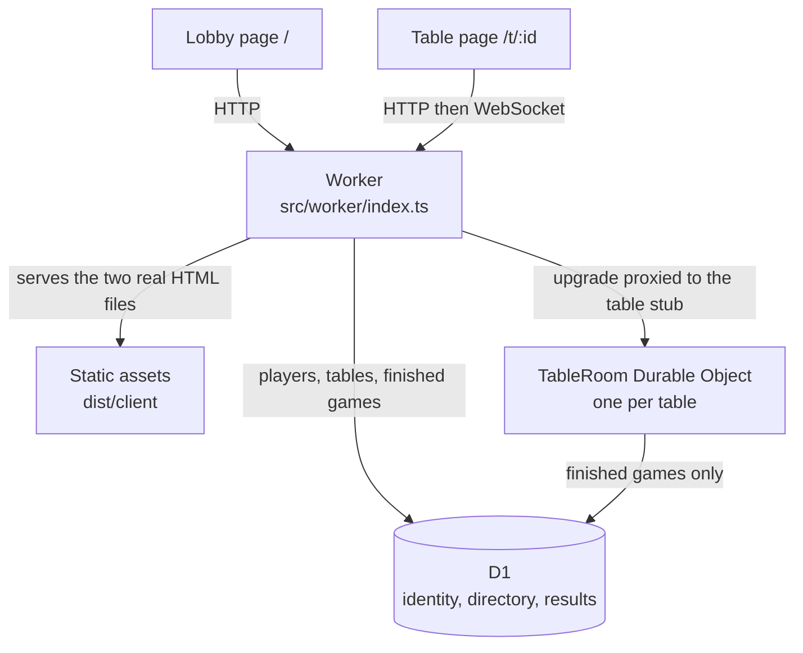
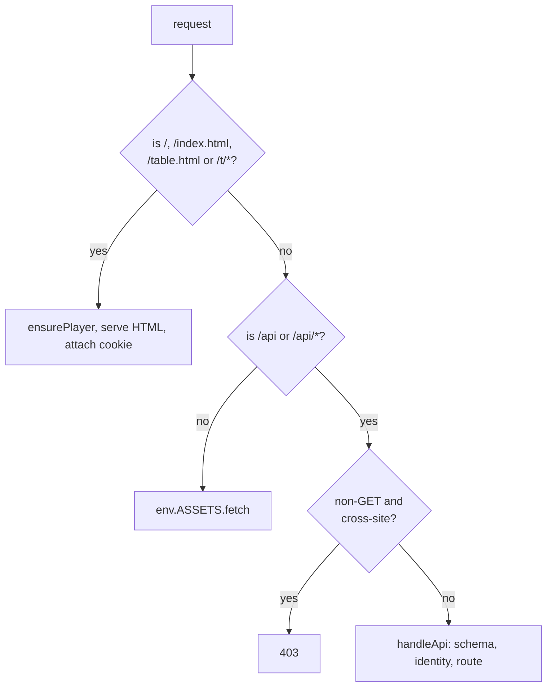

# Architecture

Mia is three runtimes and one database arranged so that the only coordination
the game needs happens in exactly one place.

## The four places state lives

The single most useful thing to know before reading any file is that state is
partitioned by lifetime, not by feature.

**D1 holds the slow state.** A player row (identity, name, last seen) and a
`tables` row (name, creator, seat count, status) outlive every game at the table.
The lobby reads the directory; identity reads the player row. A finished game's
result rows are written once, at game over, and never updated.

**The Durable Object holds the fast state.** A `TableRoom` owns the live
`MiaState`: whose turn it is, the cup, the standing announcement, the hidden
dice, the event log. None of it is ever written to D1 while the game is running.
It is persisted as a single storage key, `room`, so every game write is atomic.

**The browser holds almost nothing.** It keeps the latest redacted snapshot and a
clock offset. Every render is a pure function of that snapshot, so a refresh or a
reconnect is indistinguishable from never having left.

**The signing key lives in D1 but is not game state.** It is a single
`app_config` row, cached per isolate, and it is the one piece of configuration
the app provisions for itself. See
[identity-and-storage.md](identity-and-storage.md) for why it is there instead of
in a secret.

## Why one Durable Object per table

A turn-based game needs exactly-once ordering of who acted when. Two players
acting on the same stale snapshot must not both succeed, and the doubt resolution
must see the same standing announcement that the doubt was called against. A
table is also an independent, naturally serialised unit: nothing that happens at
one table can affect another.

Those two facts point at the same design. Give each table its own object, keyed
by the table id through `env.TABLE.getByName(tableId)`, and the platform
serialises that table's actions for free. There is no locking protocol to write,
no optimistic-concurrency check to get wrong, and no database round trip per
move: the game state is in the object's memory and in its own storage. The
alternative — a shared coordinator or a row-level lock in D1 — buys nothing here
and adds a failure mode the game does not have.

The table id doubles as the object's name — `getByName` keeps that mapping
one-to-one. The id is passed along on the upgrade anyway, per the comment in
`table-room.ts`: an object cannot reliably recover its own name from inside
`fetch`, so the Worker forwards the canonical `X-Mia-Table-Id` instead.

## The Worker is a router and an identity desk

The Worker does no game logic. It serves assets, resolves the caller's identity,
answers the JSON API, and proxies the WebSocket upgrade into the right table
object. That thinness is deliberate: every rule about the game lives in the pure
engine, and every rule about the live table lives in the Durable Object, so there
is exactly one implementation of each.

It also does two things people forget it does:

- **The upgrade is where authority is attached.** The Worker looks up the D1
  `tables` row, then overwrites `X-Mia-Player`, `X-Mia-Name`, `X-Mia-Table-Name`,
  `X-Mia-Table-Id`, `X-Mia-Host-Id` and `X-Mia-Spectator` on the forwarded
  request. A client cannot forge any of them because the Worker uses `set`, not
  `append`: a client-supplied value is replaced rather than joined by a second
  one. The spectator header is not authority — it only ever drops a seat — and it
  is derived from the `?watch=1` query so the object still hears only what the
  Worker says. `test/headers.test.ts` drives the real Worker with all six forged
  and asserts the Durable Object still sees the cookie's player and the table's
  D1 record. Any future header the Durable Object trusts must be added to this
  list, because the object itself has no way to tell a forwarded header from a
  client-supplied one.
- **Cross-site writes are rejected before routing.** A non-GET request whose
  `Sec-Fetch-Site` header is neither `same-origin` nor `none` gets a 403. That is
  cheap CSRF cover for the demo; it does not protect against a non-browser
  client, which the API never claimed to need.

## Routing: two real files and no fallback

This is the part of the codebase most likely to be "simplified" into a bug, so it
is worth stating as a series of decisions rather than a description.

`wrangler.jsonc` sets `html_handling: "none"` and `not_found_handling: "none"`.
Both are load-bearing:

- The default `html_handling` would redirect `/table.html` to `/table`. The
  Worker internally fetches `/table.html` to serve the shareable join link
  `/t/:id`, and the redirect would hand the browser a URL with the table id
  stripped out.
- `not_found_handling: "single-page-application"` would return `index.html` with
  HTTP 200 for *every* unmatched path, API routes included. A typo in an API path
  would then parse HTML as JSON instead of failing, which is the kind of bug that
  is found in production rather than in a test.

Given those settings, the Worker's routing is small and has one subtlety:

- `/`, `/index.html` and `/table.html` are real files. `/t/<anything>` is not a
  file, so it falls through to the Worker, which serves `/table.html` and lets
  the client read the id from `location.pathname`.
- Everything that is not an API path is handed straight to the asset binding.
- The API guard must test *both* forms. `startsWith("/api/")` alone does not match
  the bare path `/api`, which would then be served by the asset binding as a 404
  instead of reaching the index route. `isApiPath` tests `pathname === "/api" ||
  pathname.startsWith("/api/")` for that reason.

## The seams between layers

These are the boundaries that must not be crossed, because each one is currently
the only thing preventing a specific class of bug:

- **D1 never sees live game state.** The only result write is `recordGame` at
  game over; the only other D1 write during play is the `tables` directory row.
  If a future feature writes a move to D1, it has taken on ordering and
  consistency work the Durable Object was doing for free.
- **The browser never enforces a rule.** `legalMoves` is used by the client only
  to decide what to render; the server re-derives and rejects. The client's copy
  is a convenience, and the trust boundary is the Durable Object.
- **Redaction happens on the server, once per socket.** The client is allowed to
  draw dice only because it was sent them. See [game-engine.md](game-engine.md).
- **The DO trusts forwarded headers as identity.** The Worker is the only party
  that can set them, so anything the DO accepts on a header is a statement the
  Worker made, not the user.
- **The pure engine has no Cloudflare imports.** That is what keeps the rules
  testable in plain Node and what stops a platform detail leaking into the game.
