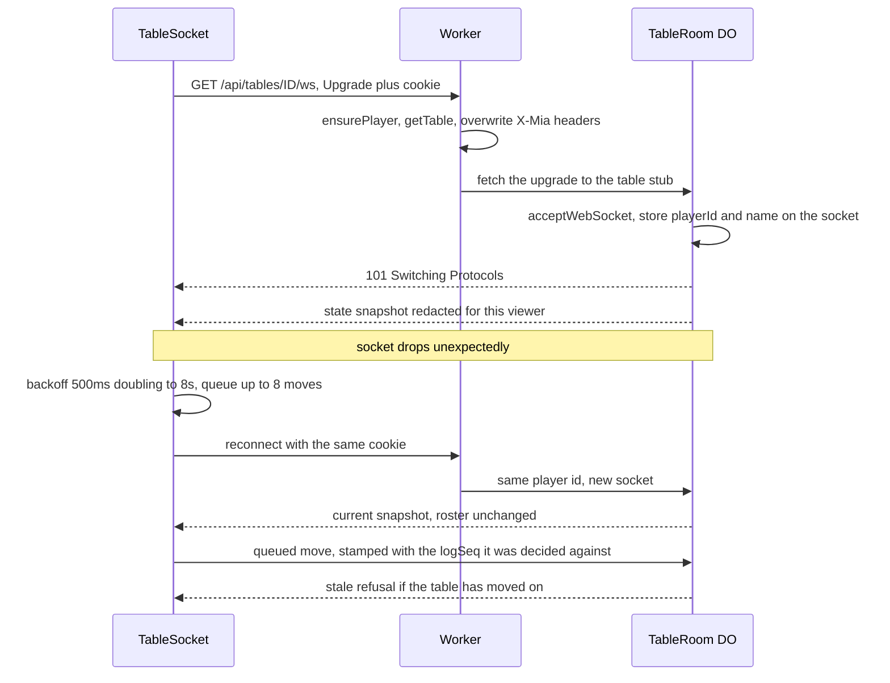

# The client

The browser side is two pages — `/` (lobby) and `/t/:id` (table) — built from
vanilla TypeScript by Vite as a multi-page app. There is no framework, and no
client-side game state beyond the latest snapshot from the server.

That shape is a decision, not an absence. Every render is a function of one
redacted `StateView`, so a refresh, a reconnect and a backgrounded tab all
converge to the same page without any reconciliation logic. There is no client
store to keep in sync with the server, because the server is the store and it
sends a whole snapshot after every change.

## Redaction is not the client's job

`client/src/table.ts` draws dice when the snapshot contains them and hides them
otherwise. It does not decide who may see what. By the time a snapshot reaches
the browser it has already been stripped for that viewer on the server (see
[game-engine.md](game-engine.md)), and the client has no way to recover what was
removed. This is why the hidden-dice check lives in the harness and the server
tests rather than in the page.

`legalMoves` is imported from the shared engine, but only to decide which buttons
to draw. The Durable Object re-derives legality and rejects anything the browser
should not have offered. The client's copy is a convenience; the trust boundary is
the server.

## The table in the round

`renderPlayers` seats everyone on an ellipse with the standing claim dead centre.
The ring is rotated so the viewer is always at the bottom, the way it works at a
real table: seat *i*'s angle is measured from the viewer's index, not from seat 0,
so the same snapshot draws every player's own view differently. The geometry
tightens from seven seats up, because eight evenly spaced avatars need a smaller
ring than five do. `seatPositions` is pure geometry with no DOM, so it lives in
its own module (`src/shared/seat-positions.ts`) and is pinned by
`test/seat-positions.test.ts` in the `unit` project across every seat count and
viewer index. The browser harness cannot reach that property — it always seats
the viewer at index 0, so the centring term is dead code in every run.

The rearrangement is visual only. The seats are still one semantic `<ul>` of
`.player` items, each keeping the contract the harness reads — `.name` (with
`.name em` marking the viewer), `.player-dice` only when the snapshot actually
carries dice, a `.badge.cup`, the `turn`/`out` classes on the seat, and one
`.pip.on` per life plus the lives `aria-label`. On the ring those pips are
candles — cream wax and a flame while the life is there, ash and a thread of
smoke once it is gone — because six identical dots do not count at a glance
across the felt. The showdown loss row keeps the compact pip, where the count
is incidental next to `−1`. Flame flicker and smoke are skipped under
`prefers-reduced-motion`; the wax still distinguishes lit from snuffed.
Chalk-tally and chip treatments were the other plate-07 options and are not
in the stylesheet. The number-next-to-the-glyph half of that plate is #32,
not this page. What changed is that the standing claim now lives in the centre
inside the same `.standing` the page-level reads use, and a claim is a text
speech bubble pinned to the claimant's chair rather than a row in a list. The
bubble is never a die, so the secrecy invariant is untouched.

Names are the full string in the DOM, so assistive tech and the harness keep
reading who someone is. At seat size other players ellipsize to one line, while
the viewer's own name wraps to at most two lines inside a slightly wider chair
and carries the full string in its `title`; the avatar circle is initials,
`aria-hidden`, and deliberately duplicates the name rather than replacing it.
The two-line clamp is the #48 fix. The viewer's chair is centred on the foot of
the ring, where the felt card leaves only ~60px below the seat centre, so an
unclamped four-to-seven-line name grew the seat downwards and carried its dice
off the felt. The dice are also laid out as a flex row rather than an inline
run, which removes the ~10px line-box slack that sat below them. `ui-check`
forces the longest pool name onto the viewer's seat and asserts the dice stay
inside `.table-card` at both three and eight seats.

Eliminated players keep their chair and are greyed; the roster is every seat, not
the survivors. Turn, cup and elimination are carried by words on badges as well as
colour and opacity, never by colour alone.

## The announce ladder

The announce UI is the ranking drawn as one vertical ladder, not a grid of the
legal values. The rungs come from `RANKING` in `src/shared/mia.ts`, highest at
the top, so the order on screen *is* the rules; the browser never sorts or
compares values to decide what to offer. `legalMoves(state, playerId).announcements`
is the authoritative legal set, and a rung is tappable exactly when it is a
member. That separation matters because the ranking is not numeric: `11` outranks
`65` while `11 > 65` is false, so a check written with `>` would offer the wrong
claims.

The standing claim is a cut line. Rungs at or below it carry a real `disabled`
attribute and are dimmed, while the rung the player actually holds stays on
screen below the cut so they can see how far they have to climb. The ladder
scrolls inside its own box, and `pinLadder` sizes that box against the viewport —
the space left below the box's own top — so its bottom edge lands on the phone's
fold and the cut is pinned there. A flat `vh` box starts part-way down the page
and puts its edge below the fold, which is the bug that sizing fixes. The height
is clamped to the space actually available with no floor: a floor larger than
that space is what pushed the box back past the fold at a full eight-seat table.
The ladder card now sits below the table in every phase. The earlier
implementation lifted it *above* the roster on the announcing turn because the
vertical roster grew with the seat count and pushed the ladder's top down; the
round table is a roughly fixed height whatever the seat count, so that reorder is
gone and the two cards stack normally (the harness checks the union of the seat
rectangles against the actions card for overlap). With a cut, the first
`disabled` rung is scrolled to the box's bottom edge, so the cheapest legal claim
is the first rung above the thumb; with no cut (a round opener) the ladder opens
at the top, where the ranking's head — Mia and the doubles — sits. Hints on the right are engine
facts — *double*, *beats every mixed roll* — not advice, and the Mia
double-penalty hint names the **doubter** as the one who pays, matching
`resolveDoubt`. `scripts/ui-check.ts` walks rendered and tappable rungs
separately, asserts the tappable set is exactly the engine's legal set, and
measures the cut and cheapest claim against the 812px fold at 375x812. It fills
its table to `MAX_PLAYERS` by default so the geometry is exercised at its worst,
and takes `MIA_UI_SEATS` to run a smaller table. The share-link step runs before
the table is filled, because a fresh session cannot take the last seat of a full
table — a separate, pre-existing bug (see `fix/full-table-join`).

## Using the width on desktop

Phone-first is the product decision, and the base stylesheet carries no width
breakpoint: `#app` caps the page at `34rem`. Above about 900px that leaves
two-thirds of the screen as felt-coloured wallpaper, so a
`@media (min-width: 900px)` block turns the table page's `.page` into three
columns — controls left, felt centre, table talk right.

The mockup drew a persistent roster in the left column, but that predates the
round table from #26: the roster *is* the ring inside `.table-card`, and there is
no vertical roster here to bring back. The left column is the interactive
`.actions` card instead — the ladder on an announcing turn, the roll/believe/
doubt buttons otherwise — so the felt and the controls stay in one view on a
laptop. The reveal from #29 is a `position: fixed` overlay, so it is out of the
grid's flow and still takes the whole screen.

The block is scoped with `:has(.table-card)` so the lobby and the waiting room
keep their single centred column, and every rule in it is additive: without a
`.table-card` the phone layout is unchanged. `pinLadder` measures the ladder
box's own top against the fold, and placing the card at the top of a column
(`position: static`, undoing the phone's sticky bottom edge) leaves that
measurement anchored.

`pinLadder` runs only from `paint()`, and there is no resize listener. A reader
who loads at a given width gets a correct box on the first snapshot, but a
viewport that changes without a repaint keeps the box it was last given. That
matters mostly to anything driving the page: measuring straight after a
`setViewportSize` reads the previous width's box and proves nothing about the new
one. Reload, or wait for a snapshot, before believing the number.

The harness's 768px viewport is below the breakpoint, so it never reached this
regime — the trap [testing.md](testing.md) names. `ui-check` now also measures
at 1280px and asserts the controls, felt and log occupy three non-overlapping
horizontal bands.

## The reveal as a showdown

The reveal is staged as a full-screen showdown, not a sentence in a card. It
plays in three beats — the cup lifts, the dice tumble and settle, the stamp
lands — and every beat is a fraction of the server's reveal window rather than a
duration of its own. The window is `deadlineAt - turnStartedAt` on the snapshot
(the server's `revealMs`), so a shortened test clock compresses the staging
instead of letting it outlive the round; the visible timer is the same
`deadlineAt`, counted by the ordinary `[data-countdown]` interval and never red,
because its 5s window is shorter than the urgency threshold. The beat and
the elapsed offset come from `src/shared/showdown.ts` (pure, unit-tested under
Node) and the CSS turns them into `--showdown-span` and `--showdown-elapsed`.

Claimed and actual stand side by side and the verdict line underneath only names
it. A caught bluff and an honest claim are opposite emotions and do not share a
layout: `BLUFF` is red and strikes through the claimed chip, `TRUE` is green,
and a real `21` gets the brass `MIA` — heavier, with the double charge named
against the **doubter**, matching `resolveDoubt`. The stamp, the tone and who
pays all come from the engine's `DoubtReveal` rather than re-deriving the rules
in the view.

The verdict decoration is itself a beat-3 arrival, not a base state. The caught
strike and red ring on the claimed chip, the brass `MIA` ring and the believed
green glow on the actual dice are animated in with the stamp, so the answer is
not on screen while the doubt is still live — the claimed and actual values stay
neutral through beats 1 and 2. This is the point of the staging: the lean
between the claim and the answer. `scripts/ui-check.ts` pins it by sampling the
first and last beat for all three tones.

`paint()` still replaces the whole DOM on every snapshot, and a snapshot can
land mid-showdown (a connect or disconnect broadcast, or a toast). A plain CSS
animation would restart from beat one in that rebuilt subtree. Instead the
element styles carry a *negative* `animation-delay` derived from
`--showdown-elapsed`, so the rebuilt subtree resumes at the frame the animation
had already reached; the reveal's identity also rides along as
`data-reveal-key`. Under `prefers-reduced-motion: reduce` the animations are off
and the base styles are the settled state, so claimed, actual and the verdict
are all still shown.

The game-ending doubt has no window to stage over — but the reason is the order
of operations inside one call, not a missing window. `resolveDoubt` sets
`phase = "revealing"` and `deadlineAt = now + revealMs`, then its trailing
`resolveEliminations` runs and, when the life loss leaves one player alive, flips
`phase` to `finished` and clears `deadlineAt` before any snapshot can carry a
revealing phase. A doubt that eliminates a player while others remain alive stays
in `revealing` and plays the full showdown. The one reveal that ends the game is
told by the filmstrip instead, below.

## The endgame screen

The finished screen is the story, not a trophy: the last round as a filmstrip,
the numbers behind it, and the way to play again.

The **filmstrip** is one small cell per claim of the final round, in order, then
the doubt in red and the truth at the end, with a caption naming what the doubt
settled. Everything in it is derived — the claims from `MiaState.events`, the
doubt and the dice from the engine's `lastReveal` — which is what makes it the
same story for everyone at the table. It renders for eliminated players and for
the spectator who opened the link after the game started; nothing in
`renderFilmstrip` reads the viewer's own seat. The strip is its own horizontal
scroll box, so a round that climbs the whole ranking scrolls sideways instead of
widening the page.

The **stats** are `statLines` from `src/shared/replay.ts`: at most two guarded
sentences per player, in ranking order, with the viewer's row highlighted and
their headline numbers above it. The lines are written where the edges can be
unit-tested — a player who never announced gets the cup line rather than a "told
the truth 0 times", and a liar rate is only shown when there is a claim to be a
rate of. The viewer's own numbers come from the redacted-until-game-over
`PlayerRecord` (see [game-engine.md](game-engine.md)).

The **rematch** button asks the server for a new table. It becomes a real link on
the same snapshot that carries `state.rematchId`, so a client that reconnects
after the press finds the link waiting for it; the button is drawn from the
snapshot, never from a local "I pressed it" flag. The button is offered only to a
viewer with a seat: a spectator sees the finished screen and a line saying that a
player can open a rematch, because the server refuses anyone without a seat and a
button whose only outcome is an error is worse than none. Once a rematch exists
its id is part of every snapshot, so the link itself is there for the spectator
too. Following it takes a spare seat if the new lobby has one — the seeded roster
may be smaller than `MAX_PLAYERS` — and is refused with the terminal `table-full`
page when the finished table was full and there is none. The spectator's own
snapshot cannot say which case they are in, because the new lobby's occupancy
lives in its own room, so the link is drawn either way and the server decides.

Above the breakpoint the filmstrip takes the centre column under the felt (the
cell the mid-game reveal card used to occupy) and the stats list spans the whole
width below the three columns; both cards exist only on the finished screen, so
neither rule matches anything during play.

## The reconnecting socket

`TableSocket` in `client/src/net.ts` wraps the WebSocket and owns reconnection. On
an unexpected close it waits `500ms * 2^min(attempt, 5)`, capped at 8 seconds,
plus a little jitter, and connects again. `close()` is the deliberate shutdown:
it marks the socket closed and stops the loop.

If a send happens while the socket is down, the message is queued — up to eight —
and replayed on the next `open`. That queue is the source of one of the more
interesting bugs in the project, described below.

A reconnect is not a special case on the server. `handleConnect` recognizes the
player id, keeps their existing seat and sends them the current snapshot, so there
is no visible difference between reconnecting and having been there all along. The
one real-time caveat is honest: while the client was away the 60-second clock may
have auto-played its turn, so the state it returns to can legitimately be further
along than the state it left.

### The stale-move stamp

A queued message is an intent from the past. If the socket dropped after the
server applied a move but before the resulting snapshot arrived, the queue replays
that move as a second action — and by reconnect time the table may be several
turns on, or in a new round entirely.

Every client message carries `logSeq`, the sequence number of the snapshot the
move was decided against. `TableSocket.send` does not add it; the callers in
`table.ts` stamp at the moment of the decision, *before* the message can reach the
queue, so a replay carries the decision-time sequence rather than a fresh one.
`applyAndContinue` in the Durable Object refuses a stamp that is not the current
`state.logSeq` before running `applyAction`, so nothing changes.

The field is optional, which keeps bare protocol clients and the older harness
working. Treating a missing stamp as "not stale" is the right default for a
trusted tool; the browser and the harness always stamp.

The guard is strict equality, and the review that approved it flagged the
consequence: it is correct today because nothing bumps `logSeq` during a player's
own turn. Any future event pushed mid-turn — a chat line, a presence notice —
would start refusing legitimate moves. A turn-scoped or monotonic comparison
would be sturdier if that happens.

## Counting down without redrawing the page

The server puts an absolute `deadlineAt` on every snapshot and the client renders
a countdown. Two clocks are involved and neither is trusted:

`TurnClock` in `src/shared/clock.ts` records `drift = clientNow - serverTime`
once per snapshot in `sync`, and `secondsLeft` measures the deadline against the
live client clock with that fixed offset. The trap is *where the drift is
measured*. Re-deriving it on every tick collapses the expression —
`deadline - (now - (now - serverTime))` is just `deadline - serverTime` — and the
countdown freezes at a constant until the next broadcast. That was a real bug; the
class carries the note because the naive reading looks correct.

The countdown also does not call `render()`. An earlier version re-rendered on
every integer change, which replaced the entire page through `innerHTML` once a
second, discarding text selection, focus, in-flight taps and CSS transitions on a
phone — all for one changing number. The interval now finds `[data-countdown]`
nodes and updates their text. Both pages separately wrap `innerHTML` assignment in
a `paint` helper that saves and restores `window.scrollY`, so a server snapshot
does not throw a scrolled phone back to the top.

### The clock as a ring

The turn clock's countdown is a ring that drains and, in its last ten seconds,
reddens; the felt desaturates toward red with it, so the clock reads in
peripheral vision while the eyes are on the ladder. `TurnClock.countdown(startedAt,
deadlineAt)` in `src/shared/clock.ts` is the whole of the arithmetic: the same
`seconds` the old pill showed, the un-rounded `fraction` of the phase window
still to run (1 is a full ring, 0 empty), and `urgent` — the one truth table for
the last ten seconds, `COUNTDOWN_URGENT_SECONDS` sitting beside it so the CSS and
the unit test cannot disagree about when the red arrives. `urgent` requires the
phase *window* to be longer than the threshold, not merely the remaining seconds:
the round-start beat (`roundStartMs`, 2s) and the reveal (`revealMs`, 5s) arm a
`deadlineAt` the same way the 60s turn does, and every frame of them is inside
ten seconds. Scoping the red to a long window is what keeps the felt green at the
top of every round, where nobody is running out of time.

Both places the countdown appears — the viewer's own seat in `renderPlayers` and
the waiting-for-someone-else card in `renderPlay` — call one `countdownMarkup`
and one tick, deliberately. There is no second countdown path: the element is a
`.countdown` with `data-countdown`, its only text is `42s`, and the ring is a CSS
`conic-gradient` driven by `--countdown-frac` on a `::before` masked to an
annulus. The number is the element's text, so the harness and a screen reader
still read it and the interval can replace the text without touching the ring;
the `conic-gradient` is used rather than an SVG `stroke-dasharray` because there
was nothing an SVG bought here.

The tick runs every 500ms and writes `--countdown-frac` and the `urgent` class on
the ring on every pass, even when the whole second has not changed, because the
ring has to move between server broadcasts. Only the text is left alone when it
already reads the same string, so a selection inside it is never dropped. The
fraction and the class go only to `.countdown` elements; the showdown's "Deal the
next round" span shares the `[data-countdown]` text hook and gets the number, but
never the ring's paint or its class, so it cannot start reddening by accident.
The `urgent` class is applied to the ring and to `.table-card`, and the felt's
class is the shared half of the treatment: it changes for everyone watching, not
only the player on turn. A seat only ever draws its ring on its own occupant's
turn (`ownTurn`), so nothing on a chair animates for a viewer whose turn it is
not — the felt is the only thing that moves for them.

The red is colour, not information: it is gated behind
`@media (prefers-reduced-motion: no-preference)`, so a reader who asked for
reduced motion keeps the neutral ring and the green felt even in the last ten
seconds. The ring still drains under reduce, because that is the number moving
rather than an animation. `scripts/ui-check.ts` pins the whole decision across
three phases: a live frame above ten seconds, a live frame below it, and the
round-start beat, where a 2s deadline makes every frame "under ten" while nobody
is running out of time — not a class it poked in. It asserts the ring drains, the
ring and the whole felt are neutral above and at the round start and red below,
the viewer's seat draws the ring on their turn, no chair does when it is not, and
the forced-urgent clone stays neutral under `prefers-reduced-motion: reduce`.

## The lobby is deliberately dumber

`client/src/lobby.ts` does not use a WebSocket. It polls `/api/tables` and
`/api/history` every four seconds, refreshes when the tab becomes visible, and
skips a poll while the rename field is open so it cannot overwrite what someone is
typing. The lobby's data is low-frequency and a few seconds stale is fine; giving
it a socket would mean a connection per idle browser sitting on the front page.

The table list marks a full waiting table as a disabled button rather than a link.
That is a fix, not styling: "Full" used to navigate into the table page, which
could only ever say "Connecting…" because there was no seat. A terminal refusal
now sets `state.fatal`, stops the socket, and renders why.

## Client error handling

`onError` receives the server's message and an optional machine-readable code.
Most errors are transient and become a toast. `table-full` is terminal: there is
no seat and no snapshot coming, so the page stops reconnecting and shows the
reason. Rendering the error before the first snapshot exists matters too — a
rejected client has no state to attach a message to, and without handling that it
would show "Connecting…" forever while the socket quietly gave up.
