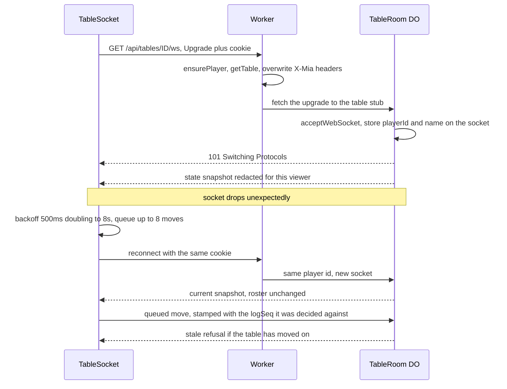

# The client

The browser side is two pages — `/` (lobby) and `/t/:id` (table) — built from
vanilla TypeScript by Vite as a multi-page app. There is no framework, and no
client-side game state beyond the latest snapshot from the server.

That shape is a decision, not an absence. Every render is a function of one
redacted `StateView`, so a refresh, a reconnect and a backgrounded tab all
converge to the same page without any reconciliation logic. There is no client
store to keep in sync with the server, because the server is the store and it
sends a whole snapshot after every change.

## Redaction is not the client's job

`client/src/table.ts` draws dice when the snapshot contains them and hides them
otherwise. It does not decide who may see what. By the time a snapshot reaches
the browser it has already been stripped for that viewer on the server (see
[game-engine.md](game-engine.md)), and the client has no way to recover what was
removed. This is why the hidden-dice check lives in the harness and the server
tests rather than in the page.

`legalMoves` is imported from the shared engine, but only to decide which buttons
to draw. The Durable Object re-derives legality and rejects anything the browser
should not have offered. The client's copy is a convenience; the trust boundary is
the server.

## The announce ladder

The announce UI is the ranking drawn as one vertical ladder, not a grid of the
legal values. The rungs come from `RANKING` in `src/shared/mia.ts`, highest at
the top, so the order on screen *is* the rules; the browser never sorts or
compares values to decide what to offer. `legalMoves(state, playerId).announcements`
is the authoritative legal set, and a rung is tappable exactly when it is a
member. That separation matters because the ranking is not numeric: `11` outranks
`65` while `11 > 65` is false, so a check written with `>` would offer the wrong
claims.

The standing claim is a cut line. Rungs at or below it carry a real `disabled`
attribute and are dimmed, while the rung the player actually holds stays on
screen below the cut so they can see how far they have to climb. The ladder
scrolls inside its own box, and `pinLadder` sizes that box against the viewport —
the space left below the box's own top — so its bottom edge lands on the phone's
fold and the cut is pinned there. A flat `vh` box starts part-way down the page
and puts its edge below the fold, which is the bug that sizing fixes. With a cut,
the first `disabled` rung is scrolled to that edge, so the cheapest legal claim
is the first rung above the thumb; with no cut (a round opener) the ladder opens
at the top, where the ranking's head — Mia and the doubles — sits. Hints on the right
are engine facts — *double*, *beats every mixed roll* — not advice, and the Mia
double-penalty hint names the **doubter** as the one who pays, matching
`resolveDoubt`. `scripts/ui-check.ts` walks rendered and tappable rungs
separately, asserts the tappable set is exactly the engine's legal set, and
measures the cut and cheapest claim against the 812px fold at 375x812.

## The reconnecting socket

`TableSocket` in `client/src/net.ts` wraps the WebSocket and owns reconnection. On
an unexpected close it waits `500ms * 2^min(attempt, 5)`, capped at 8 seconds,
plus a little jitter, and connects again. `close()` is the deliberate shutdown:
it marks the socket closed and stops the loop.

If a send happens while the socket is down, the message is queued — up to eight —
and replayed on the next `open`. That queue is the source of one of the more
interesting bugs in the project, described below.

A reconnect is not a special case on the server. `handleConnect` recognizes the
player id, keeps their existing seat and sends them the current snapshot, so there
is no visible difference between reconnecting and having been there all along. The
one real-time caveat is honest: while the client was away the 60-second clock may
have auto-played its turn, so the state it returns to can legitimately be further
along than the state it left.

### The stale-move stamp

A queued message is an intent from the past. If the socket dropped after the
server applied a move but before the resulting snapshot arrived, the queue replays
that move as a second action — and by reconnect time the table may be several
turns on, or in a new round entirely.

Every client message carries `logSeq`, the sequence number of the snapshot the
move was decided against. `TableSocket.send` does not add it; the callers in
`table.ts` stamp at the moment of the decision, *before* the message can reach the
queue, so a replay carries the decision-time sequence rather than a fresh one.
`applyAndContinue` in the Durable Object refuses a stamp that is not the current
`state.logSeq` before running `applyAction`, so nothing changes.

The field is optional, which keeps bare protocol clients and the older harness
working. Treating a missing stamp as "not stale" is the right default for a
trusted tool; the browser and the harness always stamp.

The guard is strict equality, and the review that approved it flagged the
consequence: it is correct today because nothing bumps `logSeq` during a player's
own turn. Any future event pushed mid-turn — a chat line, a presence notice —
would start refusing legitimate moves. A turn-scoped or monotonic comparison
would be sturdier if that happens.

## Counting down without redrawing the page

The server puts an absolute `deadlineAt` on every snapshot and the client renders
a countdown. Two clocks are involved and neither is trusted:

`TurnClock` in `src/shared/clock.ts` records `drift = clientNow - serverTime`
once per snapshot in `sync`, and `secondsLeft` measures the deadline against the
live client clock with that fixed offset. The trap is *where the drift is
measured*. Re-deriving it on every tick collapses the expression —
`deadline - (now - (now - serverTime))` is just `deadline - serverTime` — and the
countdown freezes at a constant until the next broadcast. That was a real bug; the
class carries the note because the naive reading looks correct.

The countdown also does not call `render()`. An earlier version re-rendered on
every integer change, which replaced the entire page through `innerHTML` once a
second, discarding text selection, focus, in-flight taps and CSS transitions on a
phone — all for one changing number. The interval now finds `[data-countdown]`
nodes and updates their text. Both pages separately wrap `innerHTML` assignment in
a `paint` helper that saves and restores `window.scrollY`, so a server snapshot
does not throw a scrolled phone back to the top.

## The lobby is deliberately dumber

`client/src/lobby.ts` does not use a WebSocket. It polls `/api/tables` and
`/api/history` every four seconds, refreshes when the tab becomes visible, and
skips a poll while the rename field is open so it cannot overwrite what someone is
typing. The lobby's data is low-frequency and a few seconds stale is fine; giving
it a socket would mean a connection per idle browser sitting on the front page.

The table list marks a full waiting table as a disabled button rather than a link.
That is a fix, not styling: "Full" used to navigate into the table page, which
could only ever say "Connecting…" because there was no seat. A terminal refusal
now sets `state.fatal`, stops the socket, and renders why.

## Client error handling

`onError` receives the server's message and an optional machine-readable code.
Most errors are transient and become a toast. `table-full` is terminal: there is
no seat and no snapshot coming, so the page stops reconnecting and shows the
reason. Rendering the error before the first snapshot exists matters too — a
rejected client has no state to attach a message to, and without handling that it
would show "Connecting…" forever while the socket quietly gave up.
