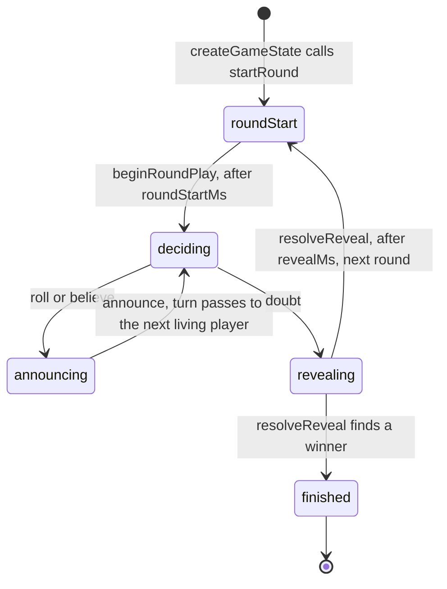

# The rules engine

`src/shared/mia.ts` is the whole game as a pure module: no Cloudflare imports, no
I/O, and no time read except the optional `now` parameter that defaults to
`Date.now()`. Every function is a transform of its arguments, which is what makes
the rules unit-testable in plain Node and what keeps the Durable Object a thin
shell around it.

The engine is also shared with the browser. The client imports `legalMoves` and
the formatting helpers from the same file, so the game's notion of a legal move
cannot drift between the two sides.

## The ranking is a table, not arithmetic

A roll's value is the higher die times ten plus the lower die — `6` and `3` is
`63`, not `9` — and the ranking is a hardcoded ordered list with `21` (Mia) at the
top, then the doubles, then the mixed rolls.

The list is hardcoded on purpose. The natural-looking alternative is to compare
face values or sums, and that is wrong in two ways that are easy to miss: a
double outranks every mixed roll regardless of face value, so `66` beats a claimed
`65`, and `11` beats a claimed `65` as well. A comparison that treats `11` as
"one and one" or as `2` reverses the order. `outranks` answers the question by
looking up positions in the table, and `applyDoubt` uses it rather than `<`.

This mistake was made once, in the very first commit, and the fix is the reason
the ranking is never computed. There is a unit test for the full order so a
"cleanup" that reintroduces arithmetic fails immediately.

Equality is deliberately *not* a bluff: naming exactly what you rolled is honest.
The caught-bluff predicate in `applyDoubt` is therefore
`!outranks(actual, announced) && actual !== announced`, not `actual < announced`.

## The randomness is rejection-sampled

`randomDie` draws one byte from `crypto.getRandomValues` and rejects the top four
values (`>= 252`) before reducing modulo six. `256` is not a multiple of six, so
a plain `% 6` would make the low faces very slightly more likely. Dice are the
one place where a fairness claim is worth the extra loop, and there is no
`Math.random()` anywhere in a game or identity path.

## The phase machine

`MiaState.phase` has five values, and one of them (`roundStart`) does double duty:
it is the beat between "a round was seeded" and "the starter may act", and it is
also the pre-game lobby, distinguished by `roundEndsAt === null` and `round === 0`.
The engine only ever plays; the pre-game roster is a Durable Object concern and
never reaches `createGameState`.

Reading the diagram with the code open:

- **`deciding` is the player's real decision.** With nothing standing,
  `lastAnnouncement` is null: `canRoll` is true while `canBelieve` and `canDoubt`
  are both false, so rolling to open the round is the only move. Once something
  stands, `canRoll` is false and the choice is believe or doubt — unless nothing
  outranks the standing value (Mia), which closes believe too and forces a doubt.
- **`announcing` means you already hold the cup.** Rolling and believing both
  `takeCup` and move straight to `announcing`; an announcement is the only legal
  action there. This is why a player holding the cup cannot doubt: core rules say
  the choice to doubt is the *next* player's, made instead of picking up the cup.
- **`revealing` is a beat, not a decision.** It exists so players can see the
  turned-over dice. The resolution is driven by the alarm, not a message.

### The roll-over-a-claim trap

`legalMoves` sets `canRoll` true only when `lastAnnouncement === null`. That looks
like a UI nicety and is actually a deadlock guard. Allowing a roll over a standing
claim lets the roller land on anything, including a roll they cannot beat — most
simply because Mia is standing and nothing outranks it. The roller is then in
`announcing` with an empty `announcements` list, every flag false, and
`autoPlaySequence` returning `[]`: a total stall reachable from one button. The
guard is in the engine, so the server enforces it, not only the browser.

## What the server does when nobody acts

`autoPlaySequence` is the agreed idle behavior: doubt when Mia stands or when no
legal announcement exists above the standing value, otherwise believe and announce
the minimum legal value. It returns a *sequence* because believing rolls the dice
and the announcement is a separate decision that follows the roll.

Note that auto-play announces the minimum legal value, not the truth. The server
can see the idle player's dice, and deliberately does not use them: the player is
absent, and the "safest legal move" is the one that keeps the game moving, not
the one that wins the bluff for them.

`autoPlaySequence` is not used only for the 60-second timer. The Durable Object
also uses it in `playOnBehalfOfTurn` to keep a table moving when the player whose
turn it is has no live socket at all. That is why a dropped phone never stalls a
game even before a turn expires.

## Doubt resolution and elimination

`applyDoubt` compares the actual roll against the announced value by rank, records
a `DoubtReveal` for the UI, applies the life loss (two when the announcement was
Mia and the dice really are `21`), and sets `nextStarterId` to whoever lost the
life. `resolveEliminations` then knocks out anyone at zero lives and decides the
game.

The starter of the next round is the player who lost the life; if that loss
eliminated them, it is the next living player after them. `resolveReveal` applies
that rule when the reveal beat expires, not at doubt time, because the reveal has
to stay on screen first.

Places come from `finalStandings`, which orders the winner first and everyone else
in reverse elimination order — surviving longer means finishing higher. They are
*not* derived from seat order, which was an early bug: a winner in a middle seat
recorded the others as 2, 3 and 5. `eliminationIndex` is written at elimination
time and read back here.

The tie-break for a simultaneous elimination is roster order, and it is
documented and tested even though it is unreachable in normal play: one doubt can
only cost one player lives. The old-record guard is worth knowing about too.
`resolveEliminations` counts already-indexed players with `!= null` rather than
`!== null`, because a record persisted before `eliminationIndex` existed has
`undefined`, and `undefined !== null` would count it as indexed and inflate every
subsequent place.

## The record, and the replay it feeds

Every player carries a `PlayerRecord`: claims made, claims that named the roll
exactly, truthful claims that were doubted anyway, doubts called, doubts that were
right, and bluffs caught. `applyAnnounce` and `applyDoubt` are its only writers.

It is a set of counters rather than something the endgame screen reads back out
of `MiaState.events`, and both reasons are worth knowing before someone
"simplifies" it into a log query:

- **The log is a 60-entry ring buffer.** `pushEvent` splices its head, so any
  game longer than that — most of them — has already lost its early claims. A
  count taken from `events` is an undercount, not a rounding error.
- **The log never learns the dice behind an undoubted claim.** Only a doubt turns
  dice over. "You told the truth twice all game" is a statement about *all* of a
  player's announcements, and the ones nobody doubted are exactly the ones the
  log cannot score.

`truths` counts an announcement that named the roll in the cup exactly; every
other announcement is a bluff here, including one *below* the real roll. That is
a deliberate definition rather than an oversight — the claim still is not the
dice the player holds — and it is the one `playerChips` turns into a liar rate.

`src/shared/replay.ts` is what turns the record and the log into the endgame
screen's material: `lastRoundFilmstrip` (every claim of the final round in order,
then the doubt and the truth) and `statLines` (at most two guarded sentences per
player). Both are pure and pinned by `test/replay.test.ts`, which is where the
edges live: a player who never announced, a two-player game, a game that ends in
round one, a real Mia.

The filmstrip takes its claims from the log and its doubt and dice from
`lastReveal` — the engine's typed verdict, not a second implementation of the
ranking comparison. A final round always fits inside the ring buffer: a round
visits each value of the ranking at most once (believe closes for good once Mia
stands), so it cannot exceed ~21 announcements, each preceded by one believe or
roll, plus the reveal — comfortably under the 60 entries kept.

## Redaction is the security boundary

The only secret in the game is dice that have not been turned over, and the rule
is per *viewer*, not per phase. `buildView(state, viewerId)` returns a structural
clone in which every pair of dice not visible to that viewer is nulled out.
Exactly one pair can be visible to anyone: your own while you hold the cup, or the
doubted player's once the phase is `revealing` or `finished`. The winner is hidden
until the game is actually over.

Two things about this are easy to get wrong and are the reason it lives in one
shared function:

- **Keyed off the viewer, not the phase.** A phase-based rule ("during a reveal,
  show all dice") is correct only as long as exactly one pair exists in the state.
  That is an accident of `takeCup` clearing the previous holder's dice, not an
  invariant of the data structure, and it has leaked before. The viewer-based rule
  is correct even if a stray pair is somehow present.
- **Per socket, not per broadcast.** Because the view depends on who is looking,
  `TableRoom.broadcast` rebuilds a snapshot for each socket instead of serialising
  once. That is a deliberate cost: it means the number of redacted snapshots per
  broadcast equals the number of connected players, and it is the price of never
  letting one player's dice into another player's JSON.

`test/room.test.ts` plants a stray pair of dice directly in the live state, drives
a doubt, and asserts nobody sees the stray pair — precisely because the earlier
victory condition could not tell the two implementations apart.

The endgame record is stripped by the same function, for every viewer, until
`gameOver` is set. Not because the counters are secret the way dice are, but
because they are news: a counter that moved the moment a claim was made would tell
the whole table whether the standing announcement was true. Keeping the rule in
`redactState` is what stops a future broadcast path from shipping a live counter
because it forgot.

`visibilityFor` and `redactState` are exported separately so the visibility rule
can be reasoned about without building a whole view.

A spectator is not a special case here. A watching socket is redacted for a
viewer id that matches no player, so `visibilityFor` grants it no own dice while
the reveal still shows the doubted pair in `revealing`/`finished`. It reuses this
one boundary rather than adding a second way to build a view, which is what keeps
the boundary from drifting.
