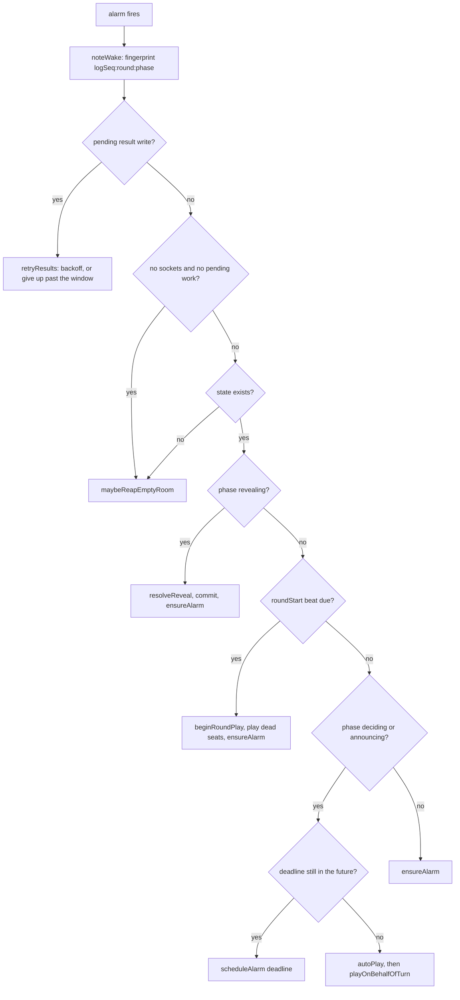

# The TableRoom Durable Object

`TableRoom` in `src/worker/table-room.ts` is where live game state lives. There is
one instance per table, reached through `env.TABLE.getByName(tableId)`, and it
owns both the state and the server end of the table's WebSockets.

The class is a shell around the pure engine in `src/shared/mia.ts`: the engine
decides what a legal action is and what the next state is, and `TableRoom` decides
when to ask, how to persist the answer, and who gets to see it.

## Hibernation

The object uses the WebSocket Hibernation API rather than holding sockets in
memory. `ctx.acceptWebSocket(server, [playerId])` hands the socket to the
runtime, and the player's id and name are stored on it with
`serializeAttachment`, so they survive the object being evicted. When a message
arrives the runtime wakes the object and calls `webSocketMessage`, which reads the
attachment back with `deserializeAttachment`.

The payoff is that an idle table — one where everyone is connected but nobody is
acting — costs nothing while it waits. The cost is a constraint that shapes the
rest of the file: **in-memory fields do not survive eviction, only storage and
socket attachments do.** Anything that has to outlive a hibernation is written to
`ctx.storage`, which is why `emptySince`, `resultsWritten` and
`resultsFirstFailedAt` are separate storage keys rather than plain fields.

Two details in the hibernation handlers are easy to lose:

- `webSocketClose` still calls `ws.close(...)` itself. The runtime has already
  seen the close, but closing the server end explicitly keeps the object's view of
  `getWebSockets()` accurate for the disconnect logic that follows.
- Player names arrive percent-encoded, because HTTP headers are latin-1 and the
  Culture ship-name pool is full of spaces. `decodeHeader` is applied to both
  `X-Mia-Name` and `X-Mia-Table-Name`. Missing one leaves
  `Unacceptable%20Behaviour` in the roster, the log and the D1 result row, which
  is exactly how that bug shipped once.

## The single alarm

`setAlarm` replaces any existing alarm, so the object cannot have two pending
timers. Everything that needs to happen later — the 60-second turn clock, the
5-second reveal beat, the 2-second round-start beat, the empty-table reap, and the
retry of a failed D1 result write — shares one "next deadline", recomputed after
every state change. The alternative, one timer per concern, is not available, and
pretending otherwise produces a table that silently drops one of its clocks.

`scheduleAlarm` is the only method that calls `setAlarm`, and a target that is
already in the past is clamped forward by at least one second. The clamp is not
cosmetic: `setAlarm` with a past timestamp fires immediately, and if the target is
recomputed from an unchanged deadline it fires immediately again, forever. That
was a real billing bug on abandoned tables. `ensureAlarm` is the main chooser of
targets; `alarm`, `retryResults`, `writeResults` and the constructor call
`scheduleAlarm` directly for their own deadlines. `clampAlarmTime` has a direct
test in `test/room.test.ts` that it never returns a past time.

The ordering at the top is deliberate. **A pending result write outranks
everything, including the reaper**, because the result is the only record that
the game was ever played. **The no-sockets check comes before the phase dispatch**
because a finished or long-quiet table matches no phase branch, and falling
through would reschedule the same stale deadline forever rather than reaping. Both
of those were bugs found by review, and the comments in `alarm` say so.

### The stagnant-wake cap

An alarm can be perpetually due. If `autoPlay` rejects its own move, the phase
does not change and the deadline stays expired, so `ensureAlarm` schedules
`now + 1s`, the alarm fires, auto-play fails again, and the table bills a 1 Hz
loop with nobody connected. A logic inconsistency is needed to start it, but once
started it never stops on its own.

`noteWake` fingerprints the state as `logSeq:round:phase` and counts consecutive
wakes that changed nothing. Past `MAX_STAGNANT_WAKES` the cases split: with no
sockets the room is handed to the reaper, and with sockets present the alarm is
disarmed and an error is logged rather than spinning. A new connection resets the
counter, because a connection is genuinely new information.

This cap is defensive, not a fix for anything currently reachable. It was reached
once — by the roll-over-a-standing-claim bug described in
[game-engine.md](game-engine.md) — before that was fixed. It stays because the
next logic gap should fail loudly instead of quietly costing money.

## Persistence order

`commit` is the write path for a state *change*, and its order is the invariant:
**storage first, then the in-memory field, then the broadcast.** If the write
fails, memory still holds the old state and the two cannot disagree. The pure
engine cooperates by never mutating its input: `applyAction` clones first and
returns a new state, precisely so the caller can persist before swapping anything.
The one other write is `persistAndBroadcast`, used only to lay down a brand-new
pre-game lobby whose state was just built in memory; it has no previous state to
disagree with.

Anything that changes an existing state outside `commit` is a bug. `handleConnect`
clones, edits the clone and calls `commit` for that reason; an earlier version
mutated `this.state` in place and then persisted, which is the one shape where a
failed write leaves the server believing something the storage does not.

`commit` also has two side effects worth knowing:

- When the state stops being a finished game (a fresh game started at the same
  table), it clears the result-write bookkeeping, so the new game cannot inherit
  the old one's markers.
- When the state becomes a finished game, it kicks off `writeResults`.

## The result write, and what happens when D1 is broken

A finished game is written to D1 once, by `writeResults`. The subtle part is how
"written" is decided. The marker is a persisted `resultsWritten` key, **set only
after D1 has actually taken the rows** — it is never inferred from
`state.gameOver`. Inferring it is an easy simplification and it silently drops a
result: a game that finishes while a transient D1 error is in flight is still
"over", so a reload infers it was written and never retries.

The rest of the mechanism exists to make a failure either recover or become
recoverable:

- A failed write arms a retry on the alarm, with exponential backoff from 1
  second capped at 5 minutes. Backing off rather than retrying tightly means a
  recovered D1 is picked up promptly without a hard failure spinning the alarm.
- The window is measured from `resultsFirstFailedAt`, persisted, so hibernating
  between retries does not restart the clock.
- After 6 hours the object gives up: `giveUpOnResults` logs the table id, the
  `gameOver` record and the final standings as a JSON payload a human can
  recover, clears the retry, and sets `resultsGivenUp`. Only then does the room
  become collectable.

The give-up window is enforced in `retryResults` and `writeResults`, not in the
`hasPendingResults` predicate. That placement is deliberate and was learned the
hard way: putting the check in the predicate stopped the room from retrying at
all, so it never reached the code that gives up and never became collectable.

`recordGame` is an `ON CONFLICT DO NOTHING` batch, so retrying after a partial
failure is safe. There is a test that fails the lobby sync *after* the result rows
have landed and asserts the retry produces no duplicates, because that is the only
way to actually exercise the idempotency the batch claims.

## Reaping an empty table

A table with nobody connected is not deleted immediately. The object records
`emptySince` (persisted, so the clock survives hibernation) and keeps the room for
`EMPTY_TABLE_TTL_MS`, one hour. When the TTL expires it marks the D1 `tables` row
`abandoned` — unless the game finished, in which case the `finished` row is left
alone — then deletes all storage and the alarm. That is the only place table
storage is ever freed and the only path that leaves the object dormant.

An unwritten result outlives the TTL. While a finished game still has a pending
result, `maybeReapEmptyRoom` tries the write and keeps the room alive if it is
still pending, rather than deleting the only copy of the game. The 6-hour give-up
window is what stops that from being forever.

Pre-game seats are different from the empty-table reap. Before the game starts, a
socket closing drops the seat (`removePreGameSeat`), so a host who closes their
tab cannot leave a ghost that blocks everyone else. Once `round > 0` the roster is
frozen instead: the seat stays, the D1 row keeps counting the player, and auto-play
covers their turns. A player with another socket still open keeps their seat in
both cases, which is why `hasOtherSocket` excludes the closing socket explicitly.

## Who may start the table

The creator is a property of the D1 `tables` row, not of who happened to open a
socket first. The Worker forwards `X-Mia-Host-Id` from that row on every upgrade,
`MiaState.hostId` carries it, and `handleStart` compares against it. An old room
that predates the field learns it on the next connect through `??=`.

The rule preserves an earlier fix: the creator is only consulted if they are
*connected*. If the creator has gone, anyone seated may start, so a table is not
bricked by an absent host. WebSocket arrival order is never authority — over a
real network it is arbitrary, and using it meant the friend who opened the link
could start while the creator was refused.

`tableId()` returns the state's table id, or `""` when there is no state at all.
An id is never guessed: `fetch` reads `X-Mia-Table-Id` and refuses the upgrade
with a 400 when it is missing, the same way it refuses one that carries no
`X-Mia-Player`/`X-Mia-Name`. An upgrade without a table id is a Worker bug — the
Worker always forwards the canonical id, which is also the object's `getByName`
name — so the object says so loudly instead of minting a placeholder. `writeResults`
and `handleStart` still refuse `""`, but that check is unreachable by construction:
`tableId()` returns `""` only when there is no state, and both callers already hold
a non-null state by the time they run. It is kept only as defence in depth, not as
the thing that keeps a guessed-id result row out of D1.

## Test seams

The seams a test needs — forcing dice, reading unredacted state, shortening the
timings, making D1 fail — are not methods on the production class. They live on
`TestTableRoom` (in `test/table-room-test.ts`), and `vitest.config.ts` binds that
subclass as `TABLE` through `test/worker-entry.ts`. The production entrypoint
never imports it, so a deployed bundle has no way to plant dice or read secret
state. The two hooks production does consult, `shouldFailResultWrite` and
`shouldFailFinishedSync`, are `protected` methods that always answer `false` in
production — empty extension points, not a usable seam. See
[testing.md](testing.md).
